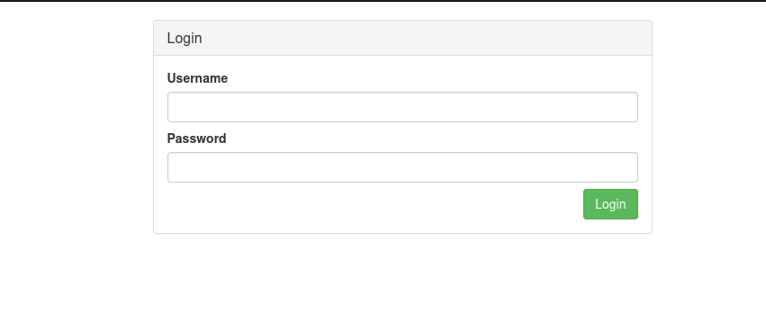

## VulnForum
Come and join the conversation on this vulnerable forum. Can you take over the admin account and view the secret messages? 

Steps:

* To start this challenge we have to start the server and we are redirected to the page.

* On the landing page we can see some public forums, and some notices and some comments from toby.

* If we check the comments. we can see toby saying how it's a closed group.

* On the home page, we can see a login button too, so let's try logging with random credentials.

* When we click on login, it gives us an error message saying "Invalid username or password".

  

* We check Burp Suite for the post request of login and send it to the repeater.

* Here you can see the credentials i used for login, and the method used here is local. Let's send the same request again and check the response.

* We get the same response with the method "local". Let's change "local" to "remote" and send the same request again.

* You can see, we got our first flag and a URL. Let's visit this url.

* Let's try to find the subdomain of this URL with help of nslookup. We get the domain and visit the website.

* Now here we have our second flag. Now let's create an account and and hit enter.

* Now we go back to the URL, where it says Invalid Domain. Refresh the page and you will get a login page, where you can login with tha same credentials you used to create the new account.

* After logging in, we can create a new user. But before let's go to the home page and click on toby and copy the hash value in the URL.

 

* Now create the user for toby and paste the hash value in the text box of Remote UUID.

* No go back to the home page and login with these credentials.

* Before logging in, turn intercept on in burp suite, and the press login. You have to change the method to remote and forward it to the login page. Now you are successfully logged in Toby's account and got your third flag.

* Here on the homepage we can see another comment in the group by John, who is the admin.

* We try to do the same thing to login as John, by creating his user and login credential, but it doesn't work. 

* Let's head towards the conversation of Toby and John.

* Here Toby has added a new feature to allow us to change the password. So let's change toby's password by going through the profile settings.

* You can see that the password has been changed. Now let's check burp suite to see if the password has been changed. We can see a GET request, send it to the repeater. We have got a authenticated token number and our new password with toby's hash value.

Let's write a comment to john for e.g."Hello".

* After we wrote a comment, John has replied an auto-generated message. Let's check the page source. 

* While checking the page source, we can see that the challenge has mention about a plugin and a URL linked to Github, let's chek it out.

* On Github we can see there is a configuration file. There are some tags gives which can be used while writing a comment to john.

* Head over to the comments tab, and let's use img as a javascript to send a comment to john.

* This was just an example, but what if we send our password change GET request in the form of JS as an Stored XSS.

* Go back to burp suite and find the request of password changed in the repeater tab. Now change the hash value of Toby to John's hash value.

* Now copy this URL and write a script with the use of IMG tag.

* With the help of this comment, whenever John will send the automated reply, his password will change to "hello123". 

* Check when he replies, and then click on logout, and log in John's account with the new password.

  

* We get our final flag here.

  

  

