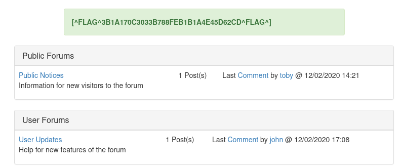

# **CTF Challenges**
### Capture the Flag(CTF) is a type of information security competition that challenges competitors to solve a variety of tasks. It is a special type of cybersecurity competition designed to challenge computer participants to solve computer security problems or capture and defend computer systems. We will start with the first challenge.

### 1. VulnLawyers:
   This is a great place to start and get a feel for how CTFchallenge works.
   
   Steps:
   * We can see the first challenge that is vulnlayers and we have to capture six flags in it.
   * To start this challenge we have to start the server and we are redirected to the page called vulnlawyers.co.uk
   * So the first step is reconnaissance i.e. content discovery. 
   * For reconnaissance, we use nslookup so that i can find any type of record on the webpage.
   * Next we will start searching for the subdomains with the help of bruteforcing with dnsrecon.
   * After finding the sub-domains, we use curl tool to see what's the data inside the sub-domain.
   * We find our first flag in this sub-domain.
   * After that we try and see if there is a login page on the website, but we are redirected to a denied page, where it says "Access is denied from your IP address".
  
  
   

   * We open Burpsuite and try to look for a GET request with the login page, and we send it to the repeater.

   

   
   * After we send the same data, in the response tab, we capture our second flag.

   
   * When we found a subdomain with the help of dnsrecon bruteforcing, we also found another URL called : 
http://data.vulnlawyers.co.uk
* We visit that URL and we find our third Flag here.
* We fuzz the new domain and visit http://data.vulnlawyers.co.uk/users, it gives us our fourth flag and few usernames we can brute force.
* We try brute forcing the usernames with the help of burp suite and find a valid username and password.
* We find the password for the user email id i.e. 
jaskaran.lowe@vulnlawyer.co.uk and the password is summer.
* After we login, we get our fifth flag and the staff portal with the current cases and who is managing it.

   
